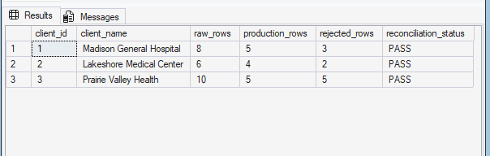
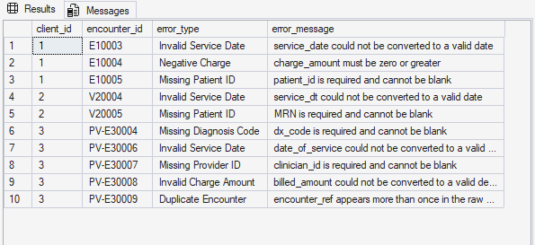
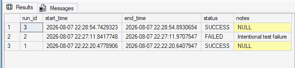
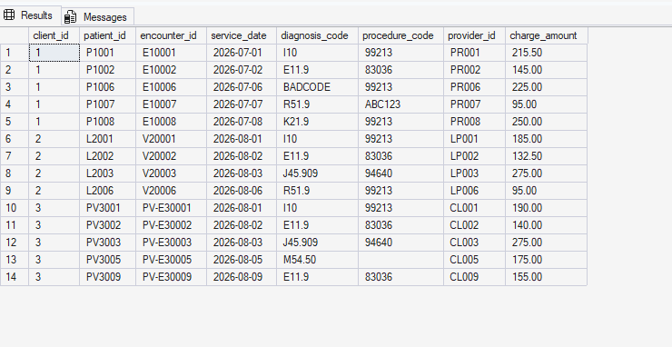

# Healthcare Client Data Intake & Quality Pipeline

A SQL Server portfolio project that simulates a healthcare data operations workflow for three fictional hospital clients.

The pipeline ingests differently formatted encounter data, validates data quality, standardizes valid records into a shared staging layer, loads production tables, logs rejected records, prevents duplicates, and performs reconciliation checks.


## Business Problem

Healthcare organizations often receive encounter data from multiple client systems, each with different column names, date formats, charge formats, and data-quality issues.

This project simulates a data operations workflow where three fictional hospital clients submit encounter data in different formats. The goal is to preserve the original source data, identify and log invalid records, standardize valid records into a common structure, load clean data into production, and verify that each client submission reconciles correctly.

## Pipeline Architecture

The project uses four SQL Server schemas to separate responsibilities:

- `raw` stores client data exactly as received.
- `staging` stores validated and standardized encounter records.
- `production` stores the final clean encounter dataset.
- `audit` stores validation errors, reconciliation results, and pipeline run history.

Data flows through the pipeline like this:

Client Raw Data  
→ Validation  
→ Rejected Rows logged to `audit.Validation_Error`  
→ Valid Rows standardized in `staging.Encounter`  
→ Clean Rows loaded to `production.Encounter`  
→ Reconciliation and pipeline status checks

## Client Source Differences

Each fictional client provides encounter data in a different source format:

- Madison General Hospital uses standard column names and `YYYY-MM-DD` dates.
- Lakeshore Medical Center uses alternate column names, `MM/DD/YYYY` dates, and dollar signs in charge amounts.
- Prairie Valley Health uses different field names, `YYYY/MM/DD` dates, and includes duplicate and invalid records.

The ETL process applies client-specific transformation logic before loading all valid records into one shared staging structure.

## Data Quality Checks

The pipeline identifies and logs several types of data-quality issues, including:

- Invalid service dates
- Missing patient identifiers
- Negative or invalid charge amounts
- Missing diagnosis codes
- Missing provider identifiers
- Duplicate encounter records

Invalid records are written to `audit.Validation_Error` with the client ID, encounter ID, error type, error message, and original source values for troubleshooting.

## ETL Workflow

The pipeline is executed through a master stored procedure:

`dbo.usp_RunHealthcareETL`

The workflow performs the following steps:

1. Creates a new pipeline run record with a status of `RUNNING`.
2. Executes validation procedures for all three clients.
3. Loads valid, standardized records into the staging layer.
4. Loads new staging records into the production encounter table.
5. Marks the pipeline run as `SUCCESS` when processing completes.
6. Marks the run as `FAILED` and logs the SQL Server error message if an exception occurs.
7. Executes reconciliation checks to compare raw, production, and rejected row counts.

## Duplicate Prevention

The pipeline is designed to be safely rerunnable.

Duplicate records are prevented through multiple layers of protection:

- `NOT EXISTS` checks prevent encounters already present in staging or production from being inserted again.
- `SELECT DISTINCT` removes exact duplicate rows from incoming client data.
- Unique constraints on `(client_id, encounter_id)` provide database-level protection against duplicate encounters.
- Prairie Valley duplicate source records are identified using `ROW_NUMBER()` and logged as validation errors.

## Error Handling and Audit Logging

Pipeline executions are recorded in `audit.Pipeline_Run`.

Each run stores:

- Run ID
- Start time
- End time
- Status
- Error notes when a failure occurs

The master ETL procedure uses SQL Server `TRY...CATCH` logic to capture processing failures.

This allows failed pipeline executions to be distinguished from successful runs and provides an audit trail for troubleshooting.

## Reconciliation

The procedure `audit.usp_ReconcileClients` compares source and destination row counts for each client.

For the included synthetic data, reconciliation checks whether:

`Raw Rows = Production Rows + Rejected Rows`

A client receives a `PASS` status when the counts reconcile and a `FAIL` status when they do not.

## SQL Server Concepts Demonstrated

This project demonstrates hands-on use of:

- SQL Server
- T-SQL
- Stored procedures
- Multi-schema database design
- ETL workflows
- Data validation
- Data standardization
- `TRY_CONVERT`
- `ROW_NUMBER()`
- `NOT EXISTS`
- `SELECT DISTINCT`
- Primary keys
- Foreign keys
- Unique constraints
- Identity columns
- `TRY...CATCH`
- `THROW`
- `SCOPE_IDENTITY()`
- Audit logging
- Reconciliation queries
- Idempotent data loading

## Project Structure

```text
Healthcare-DataOps-ETL/
│
├── sql/
│   ├── 01_create_database_and_schemas.sql
│   ├── 02_create_tables.sql
│   ├── 03_create_raw_tables.sql
│   ├── 04_seed_sample_data.sql
│   ├── 05_validation_procedures.sql
│   ├── 06_staging_procedures.sql
│   ├── 07_production_procedure.sql
│   ├── 08_reconciliation.sql
│   ├── 09_master_etl.sql
│   └── 10_demo_queries.sql
│
├── screenshots/
├── docs/
├── sample_data/
└── README.md

For a visual overview of the pipeline, see [docs/architecture.md](docs/architecture.md).

How to Run the Project

Run the SQL scripts in numerical order:

01_create_database_and_schemas.sql
02_create_tables.sql
03_create_raw_tables.sql
04_seed_sample_data.sql
05_validation_procedures.sql
06_staging_procedures.sql
07_production_procedure.sql
08_reconciliation.sql
09_master_etl.sql

Then execute:

EXEC dbo.usp_RunHealthcareETL;

To view example outputs and audit results, run:

10_demo_queries.sql

Sample Results

Using the included synthetic dataset:

Client	Raw Rows	Production Rows	Rejected Rows	Status
Madison General Hospital	8	5	3	PASS
Lakeshore Medical Center	6	4	2	PASS
Prairie Valley Health	   10	5	5	PASS

The sample dataset intentionally includes invalid and duplicate records to demonstrate validation, rejection logging, transformation, duplicate handling, and reconciliation.


## Screenshots

### Reconciliation Results



### Validation Errors



### Pipeline Run History



### Production Encounter Data




Purpose

This project was built to demonstrate practical SQL Server and ETL skills in a healthcare data operations scenario.

It focuses on the kinds of problems commonly encountered when receiving data from multiple external clients: inconsistent formats, invalid values, duplicates, standardization requirements, quality control, auditability, and reliable production loading.

All healthcare organizations, patient identifiers, encounters, and records in this repository are fictional and synthetically created for demonstration purposes.